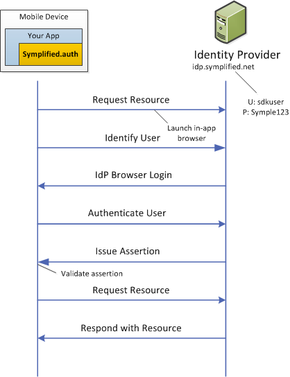

## The Symplified Identity Provider (IdP) Sandbox

Use our SAML 2.0 environment with a hosted IdP and test account to quickly build a functional app. Swap in your production IdP when you're ready to deploy.

Here is the protocol flow between your app and the IdP:



> Need help understanding single sign-on terminology, like IdP and SP? The folks at Salesforce.com have provided a good overview:  [About Identity Providers and Service Providers](http://login.salesforce.com/help/doc/en/identity_provider_about.htm).


## 0. Acquire SAML 2.0 metadata

SAML metadata provides information about the identity provider (IdP) used for the authentication and single sign-on service. It is an XML document containing data such as server URIs, protocols, certificates, and so on.

We've provided an example to get you up and running.

```csharp
Mike, please insert code here.
```


## 1. Create and configure an IdP

Let's get the website information required to use Symplified's IdP for your application. We'll load the  load the XML document containing SAML 2.0 metadata, and send it off to a metadata parser:

```csharp
Mike, please insert code (4 lines) here.
```

## 2. Create and configure a SAML 2.0 authenticator

To verify an assertion that returns from the IdP, we'll configure an authenticator using the IdP metadata:

```csharp
Mike, please insert code here.
```

The authenticator will:

* Create a SAML assertion
* Send it to the IdP
* Get an assertion back
  The assertion is issued depending on conditions such as the user's log in state
* Verify the signature on the assertion
* Request resource


## 3. Authenticate the user via the IdP


Although third-party authenticators control their own UI, you decide how to show the authenticator's UI on the screen. You can manage how the authentication UI is presented–modally, in navigation controllers, in popovers, and so on.

Prior to displaying the UI, we must first listen for the `Completed` event which triggers when user successfully authenticates or cancels. Find out whether the authentication succeeded by examining the `IsAuthenticated` property of `eventArgs`:


```csharp
Mike, please insert code here
```

All the information collected from a successful authentication is accessible in `eventArgs.Account`.

We are now ready to display the login UI from `ViewDidAppear` on iOS:

```csharp
Mike, please insert code here
```

The `GetUI` method returns `UINavigationControllers` on iOS, and `Intents` on Android. Here is how we would write the code to display the UI from `OnCreate`:

```csharp
Mike, please insert code here
``


## 4. Store the account


The Symplified Mobile Developer SDK securely stores `Account` objects so you don't always have to reauthenticate the user. The `AccountStore` class is in charge of storing `Account` information, supported by the [Keychain](https://developer.apple.com/library/ios/#documentation/security/Reference/keychainservices/Reference/reference.html) on iOS and a [KeyStore](http://developer.android.com/reference/java/security/KeyStore.html) on Android:

```csharp
Mike please insert code here.
```

Saved Accounts are uniquely identified wiht a key composed of the account's `Username` property and a "Service ID". The "Service ID" is any string that is used when retrieving accounts from the store.

If an `Account` was saved earlier, calling `Save` again will overwrite it. This is helpful for services that expire the credentials stored in the account object.


## 5. Retrieve stored accounts


You can get all `Account` objects stored for a given service:

```csharp
Mike, please insert code here.
```


## Next Steps

### Exchange SAML 2.0 assertion for OAuth 2.0

You can bridge SAML 2.0 to REST APIs using the Symplified Mobile Developer SDK. For example, you can enable a third-party IdP such as [Salesforce](http://login.salesforce.com/help/doc/en/identity_provider_about.htm), then  federate authentication.

```csharp
Mike, please insert code here.
```
